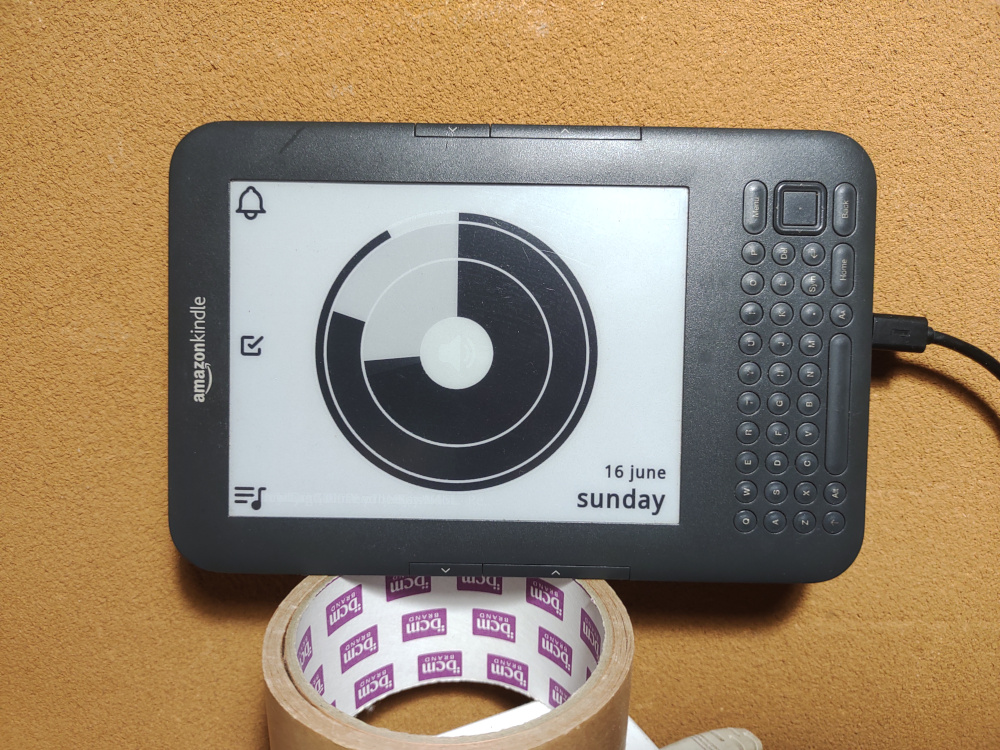

# Kindle Analog Clock
 
This repo is for a simple analog clock on old kindle 3.

## Screenshots

&nbsp;

## Requirements

- Jailbroken Kindle 3: https://wiki.mobileread.com/wiki/Kindle_Hacks_Information
- Server: Minimum 256M/100M OpenWrt router or SBC (e.g. OrangePi zero)
- Server OS: Openwrt, Ubuntu and Debian, etc which works with Python v3.11 or newer.
- Server's devices: USB port x1, LAN port x1


## Kindle PNG format

kindle requires special PNG format. Converting process is as follows:

```
                                               [The server sends a PNG file to Kindle and displays it]
 SVG image ------------> PNG image ----------> flattened PNG image --> Kindle Dispaly
           converter:              converter:
            cairosvg                Wand


           
```

## Set up server

### 1. Install the program

Copy `(github)/server/opt/lib/kindle-analog-clock` to `(server)/opt/lib/kindle-analog-clock`.

### 2. Edit config files

#### a) user config

`setting.json`

- timezone: required (default: local)
- set_interval: 5 (default)
- invert_color (WIP)
- reflesh_min (WIP)
- reflesh_hour (WIP)
- layout: landscape (fixed)
 
#### b) alarm config

##### setting

setting file: `alarm.json`

- on/off: boolean
- time: 24 hour format
- sound: sound file

#### c) music config

##### Requirement

- Third-party program `mplayer`: https://www.mobileread.com/forums/showthread.php?t=119851

##### Excutable file location

- `/mnt/us/mplayer/mplayer`

##### setting

setting file: `music.json`

- on/off: boolean
- start time: 24 hour format
- stop time: 24 hour format
- playlist: a directory name under `(working directory)/music`
- playmode: one of `normal`, `reverse` and `shuffle` 
- repeat: (WIP)
- file_location: `server` or `kindle`(WIP)

Note:

- audio format is mp3 or m4a.
- music file location
  - server: (working directory)/music/(dir name)  
  - kindle: /mnt/us/audible/(dir name)
- Getting song info is dirty hack, it is not guaranteed that it works all the time.

  
<kbd></kbd>&nbsp;
 
 
#### d) task config

##### setting

setting file: `schedule.json`

- on/off: boolean
- time: 24 hour format
- valid: minute
- title: string
- items: number(string): string 

<kbd></kbd>&nbsp;


### 4. Install programs, Python3 and it's modules.

#### Application requirements

- imageMagick
- cairo

#### Python3(v3.11 or newer) and module requirements

- setuptools
- pip
- Wand
- cairosvg
- tzdata

e.g.) Openwrt

```
opkg update
opkg install python3 python3-setuptools python3-pip
opkg install imagemagick
opkg install cairo
pip3 install cairosvg
pip3 install Wand

```

#### Installation for Openwrt: To use Cairo on Openwrt.


1. Download SDK from Openwrt site.
2. Compile `cairo` with SDK and install the build package or use the pre-build package in this repository. (armv8 only)
3. Install `cairosvg` via pip.
4. Install a TTF font (e.g. `Sans_Regular.ttf` in this repository) to server's /root/.fonts (Optional)
5. Run `fc-cache -f`  (Optional)

e.g.)

```
opkg install cairo_1.18.0-1_aarch64_generic.ipk
opkg install fontconfig #(optional)
pip3 install cairosvg
```

### 5. Network Time Synchronization

To retrieve data correctly, setup NTP server.

### 6. Test run

All set up finished, then try it.

#### a) test 1: Output to a SVG file

`./clock.py svg`

It will create a SVG file in working directory.

#### b) test 2: Output to display and a PNG file

`./clock.py display` 

Open `index.html` with brawser and see it.
Or take a look at `/tmp/KindleAnalogClock_flatten.png`.

#### c) final test
 
`./clock.py` [config] # default config

The program makes a PNG and display it on Kindle.


### 7. Install USB network

Connect a USB cable to both the server and Kindle.&nbsp;
USB cable uses for network and power supply.&nbsp;
Install all relevant packages.&nbsp;
Both 8000/tcp and 8001/tcp ports must be open.

e.g.) Openwrt

```
opkg install kmod-usb-net kmod-usb-net-rndis kmod-usb-net-cdc-ether usbutils
```

## Set up Kindle

### 1. Set up usbnet

The server: 192.168.2.1/24

Kindle    : 192.168.2.2/24 (fixed address)

```
                LOCAL NETWORK               USB NETWORK			
                e.g.(192.168.1.0/24)
 WAN <-> ROUTER <--------------> THE SERVER <------> KINDLE
                                 192.168.2.1/24      192.168.2.2/24
		
```
When usbnet setup is finished, access to Kindle. (no password)

```
ssh root@192.168.2.2
```

### 2. Set up ssh Auth key

- Create the server's pubkey.
- Set up the server's ssh client environment.
- Copy the server's ssh pubkey to Kindle.

e.g.) dropbear (OpenWrt)

```
cd /etc/dropbear
dropbearkey -y -f dropbear_rsa_host_key | grep "^ssh-rsa " > dropbear_rsa_host_key.pub
mkdir /root/.ssh
cd /root/.ssh
ln -s /etc/dropbear/dropbear_rsa_host_key id_dropbear
cd -
scp dropbear_rsa_host_key.pub root@192.168.2.2:/tmp
ssh root@192.168.2.2  # access to Kindle
cat /tmp/dropbear_rsa_host_key.pub >> /mnt/us/usbnet/etc/authorized_keys
exit
ssh root@192.168.2.2  # test passwordless login
```

e.g.) openssh (Openwrt)

```
cd /root/.ssh
opkg update
opkg install openssh-client openssh-keygen openssh-sftp-client
ssh-keygen -t ecdsa
scp id_ecdsa.pub root@192.168.2.2:/tmp
ssh root@192.168.2.2  # access to Kindle
cat /tmp/id_ecdsa.pub >> /mnt/us/usbnet/etc/authorized_keys
exit
ssh root@192.168.2.2  # test passwordless login
```

### 3. Test run

```
cd /opt/lib//kindle-analog-clock
./start.sh   # start
./end.sh     # end
```

## Set up time schedule

Edit the server's crontab and restart cron.

e.g.)

```
30 * * * * sh -c '/opt/lib/kindle-analog-clock/start.sh  2>>/tmp/kindle-analog-clock.err'
59 * * * * sh -c '/opt/lib/kindle-analog-clock/end.sh  2>>/tmp/kindle-analog-clock.err'
```

# Credits

- [Amazon Kindle](https://www.amazon.com/), Amazon's E Ink e-readers.
- [Mplayer](https://www.mobileread.com/forums/showthread.php?t=119851), Kindle3 media player
- [SVG Icon](https://iconduck.com/), public dmain SVG icon site.
  - bell icon: MIT License
  - bell ringing 2 icon: MIT License
  - task done icon: MIT License
  - speaker icon: MIT License
  - queue music icon: Apache License 2.0